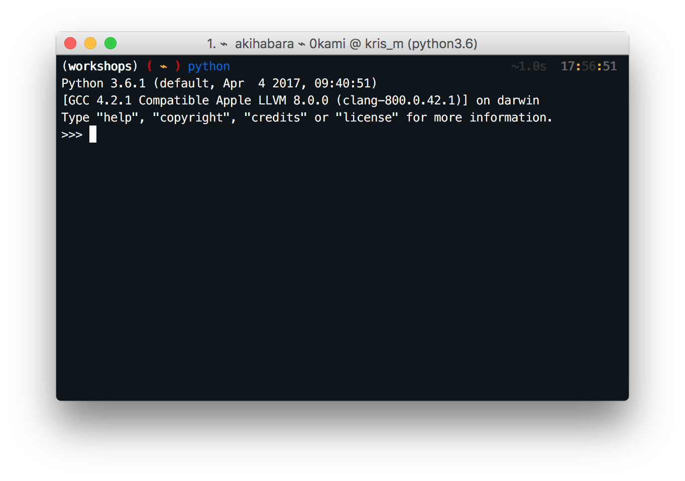
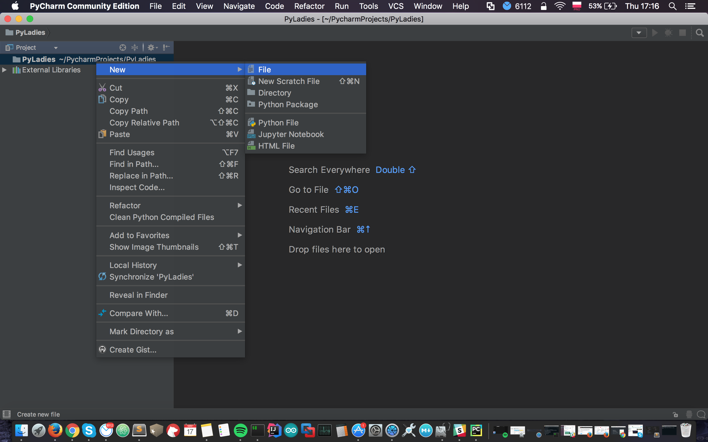
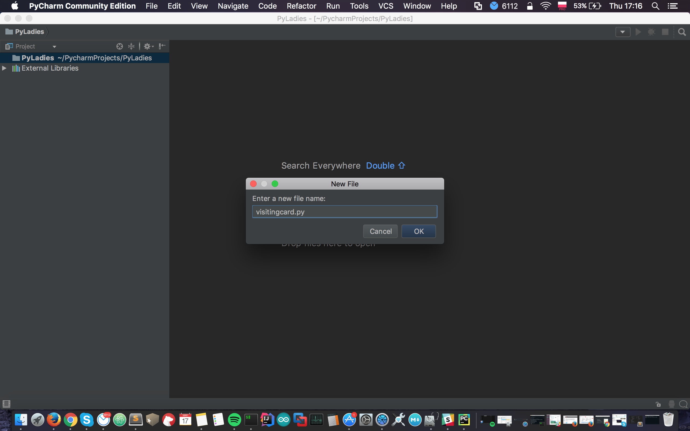
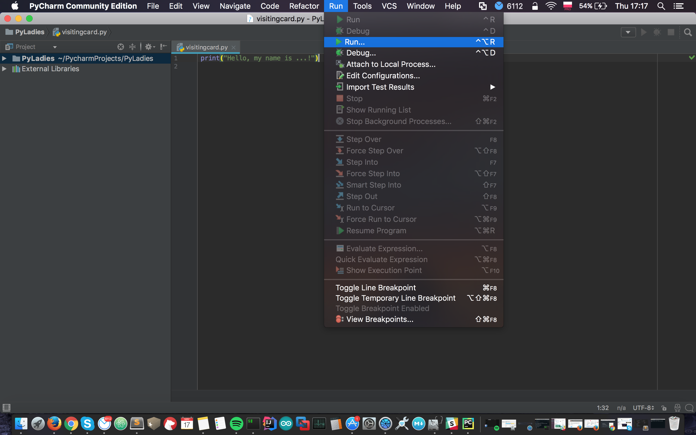
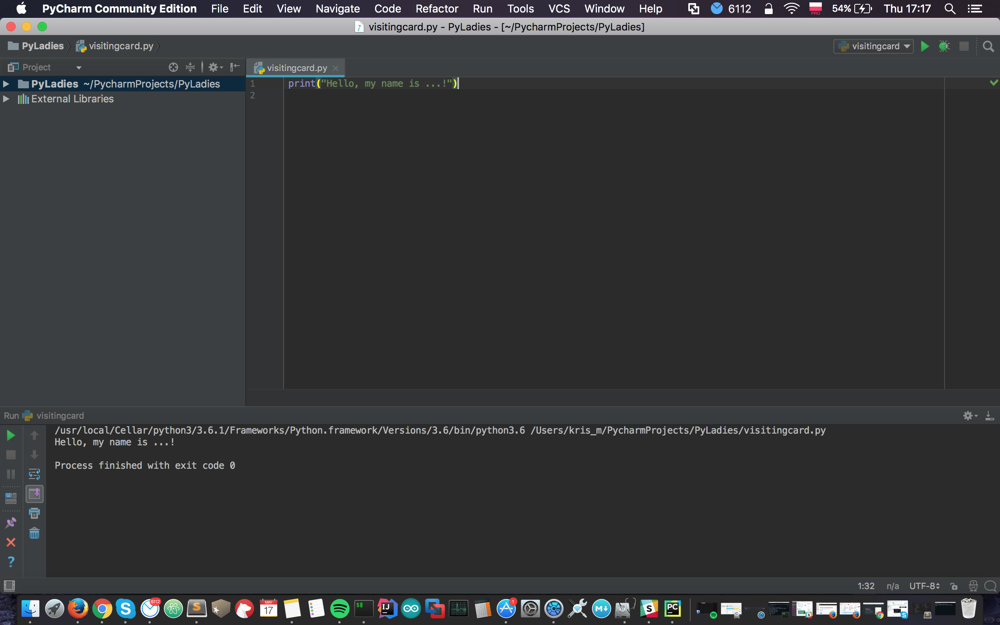

Pierwsze kroki z interpreterem Pythona i IDE Pycharma
=====================================================

Rozpocznijmy od uruchomienia interpretera Pythona, którego
zainstalowaliśmy w poprzednim rozdziale. Proszę uruchomcie:

```bash
(workshops) ~$ python
Python 3.8.0 (...)
Type "copyright", "credits" or "license" for more information.

>>>

>>>

```



Wcześniej pracowaliśmy w wierszu poleceń systemu operacyjnego i mogliśmy
wprowadzać komendy. Znakiem zachęty był `~$`. Po uruchomieniu komendy `python`, 
znak zachęty zmienił się na `>>>`. Oznacza to dla nas, że od tej chwili możemy
używać tylko komend języka Python. Wcześniej poznane komendy (takie, jak
'cd', 'mkdir') nie będą działały. Nadszedł moment rozpoczęcia nauki
nowego języka!

Nie wpisujemy znaku zachęty `>>>` (podobnie jak `~$`) - interpreter zrobi to za nas.

Przedstaw się
=============

Stringi
-------

Jednakże liczby nie wystarczają, by efektywnie się komunikować. A zatem
musimy się nauczyć, jak używać 'stringów'. Oto kilka przykładów:

```python
>>> "Hello World" 
'Hello World' 
>>> 'Foo Bar' 
'Foo Bar' 
>>> "Rock 'n' Roll" 
"Rock 'n' Roll" 
>>> 'My name is "James"' 
'My name is "James"'
```

Stringi możecie dodawać w następujący sposób:

```python
>>> 'My name is ' + '"James"' 
'My name is "James"'
```

lub mnożyć przez liczby całkowite:

```python
>>> 'Hastur' * 3 
'HasturHasturHastur'
```

String zawsze musi zaczynać się i kończyć tym samym znakiem. Może to być 
pojedynczy cudzysłów (`'`) lub podwójny cudzysłów (`"`). Nie ma to wpływu na
wartość stringa, np. wpisanie `"Batman"` tworzy string `Batman` -
cudzysłowia nie są jego częścią, wskazują tylko, że jest to string 
(niestety, Python nie jest wystarczająco bystry, by to samemu odgadnąć).

Wyświetlanie stringów
---------------------

W jaki sposób prezentujemy wartości, by móc je przeczytać? Możemy to zrobić
przy użyciu komendy print:

```python
>>> print("Hello World") 
Hello World
```

W podobny sposób możemy napisać kilka stringów w tej samej linii bez
konieczności dodawania ich do siebie. Będą one oddzielone spacjami:

```python
>>> print("Hi, my name is", "Łukasz") 
Hi, my name is Łukasz
```

Komenda print ma wiele więcej zastosowań, gdyż może wyświetlić prawie
wszystko. W tej chwili jedynymi znanymi nam wartościami są liczby:

```python
>>> print(1)
1 
>>> print(1, 2, 3) 
1 2 3
>>> print("2 + 2 =", 2 + 2) 
2 + 2 = 4
```

Kończymy chwilowo z konsolą intraktywną. Aby z niej wyjść, wpiszcie
quit():

```python
>>> quit()
```

lub przytrzymajcie `Ctrl+D` (dla Linuxa) lub `Ctrl+Z` (dla Windows).

Pliki źródłowe
==============

Dotychczas nasz kod był wykonywany w sposób interaktywny. Podawaliśmy 
poszczególne komendy i natychmiast otrzymywaliśmy odpowiedź. To świetny sposób,
by eksperymentować i uczyć się nowych składników języka, stąd ostatecznie
wrócimy to tego sposobu.

Nasz pierwszy program będzie wyglądał tak:

print("Hi, my name is Lucas")

Aby napisać i zapisać kod w pliku, musimy użyć edytora tekstu. Poszukajcie
edytora tekstu, który działa w Waszym OS (użyj [listy edytorów w 
Wikipedii](http://en.wikipedia.org/wiki/List_of_text_editors), by znaleźć przykłady).
Rekomendujemy Wam PyCharm lub Sublime. Sublime jest
napisany w Pythonie :). Wpiszcie w edytorze powyższy kod w Pythonie i zapiszcie
go w nowym pliku o nazwie `visitingcard.py`. Następnie uruchomcie Wasz 
pierwszy program w Pythonie w wierszu poleceń przy użyciu:

```bash
(workshops) ~$ python visitingcard.py
Hi, my name is Lucas
(workshops) ~$

(workshops) ~$

```

Pojedynczy program może zawierać więcej niż jedną komendę. Każda z nich
powinna być w osobnym wierszu. Na przykład:

```python
print("Hi,")
print()

print("my name is Lucas")

print()
print("Bye.")

print("Bye.")
```

Aby zwiększyć przejrzystość pliku `visitingcard.py`, w dowolnym jego
miejscu możemy wprowadzać puste wiersze. Tutaj oddzieliliśmy nagłówek
wiadomości od jej zawartości i zakończenia.

Tworzenie i uruchomienie pliku w edytorze PyCharm
================================

Aby utworzyć plik, wciśnij prawy przycisk myszy na nazwie projektu i wybierz "New" ("Nowy") a następnie "File" ("Plik").

W oknie, które się pojawi wpisz nazwę pliku (na przykład `visitingcard.py`).





Wypełnij teraz plik treścią skryptu.

Aby go uruchomić, wybierz "Run" ("Uruchom"), a następnie opcję o nazwie takiej jak uruchamiany plik (`visitingcard.py`).

Wynik skryptu zostanie wyświetlony (domyślnie) w oknie na dole ekranu.




